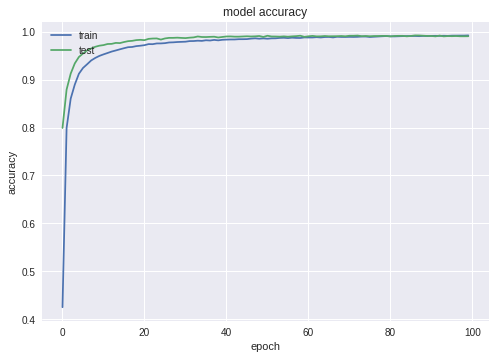
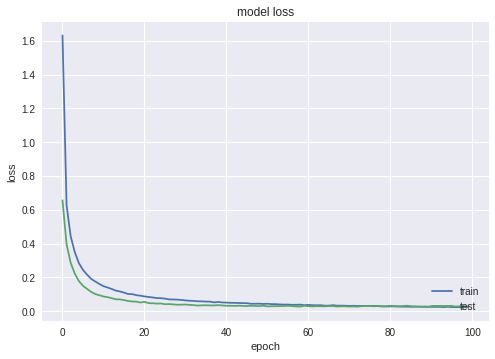

# Digit-recognition with keras

 

Model has been trained using google colab : https://colab.research.google.com/


<h2>Dependencies</h2>

<ul>  
  <li>Keras</li>
  <li>Seaborn</li>
  <li>Sklearn</li>
  <li>Matplotlib</li>
</ul>

<p>
  Install dependencies :

  ```
  pip install -r requirements.txt
  ```

</p>
<p>
	<h2>Dataset description </h2>
	60000 digit used for training, 10000 for validation


</p>

<p>
	<h2>Model evaluation</h2>
	<ul>
		<li>Accuracy : 99,16% on validation set </li>
		<li>Loss : 2,43% on validation set </li>
	</ul>





</p>
